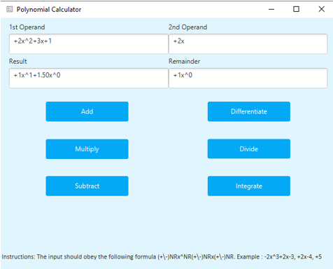

Certainly! Here is the revised summary with the example picture included:

# Polynomial Calculator

## Objective
Design and implement a polynomial calculator with a graphical interface that allows users to input polynomials, select mathematical operations (addition, subtraction, multiplication, division, derivative, integration), and view the results. The calculator should work with polynomials of one variable and integer coefficients.

## Problem Analysis
- A polynomial is an expression consisting of variables, coefficients, and mathematical operations.
- The calculator needs a user interface for inputting polynomials and displaying results.

## Design
- Use the Model-View-Controller (MVC) design pattern.
- Model: Represents the polynomials and performs calculations.
- View: Displays the user interface.
- Controller: Handles user input, validates data, and invokes model operations.

## Implementation
- Monomial class: Represents a monomial with a coefficient and a power.
- Polynomial class: Represents a polynomial as a collection of monomials.
- Controller class: Handles user interactions and invokes appropriate model operations.

## User Interface
The user interface allows users to:
- Input polynomials.
- Select operations (addition, subtraction, multiplication, division, derivative, integration).
- View the results.

Example User Interface:

## Conclusion
The polynomial calculator project demonstrates the use of the MVC design pattern, user interface design with JavaFX, and algorithm implementation for polynomial operations. It provides a convenient tool for performing calculations with polynomials.